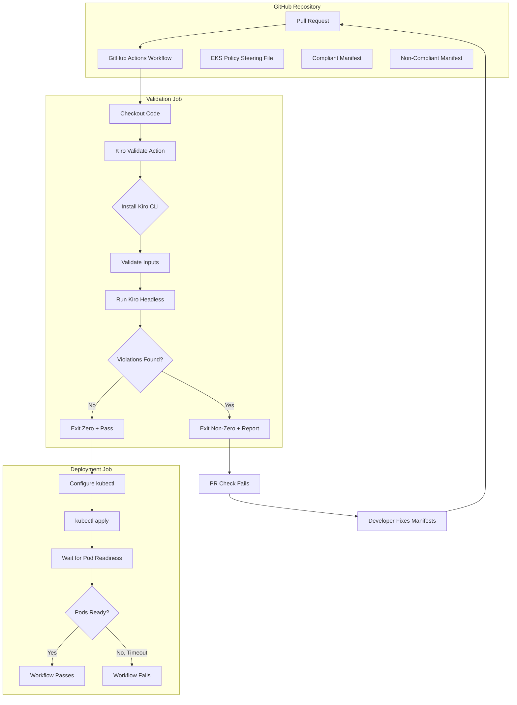
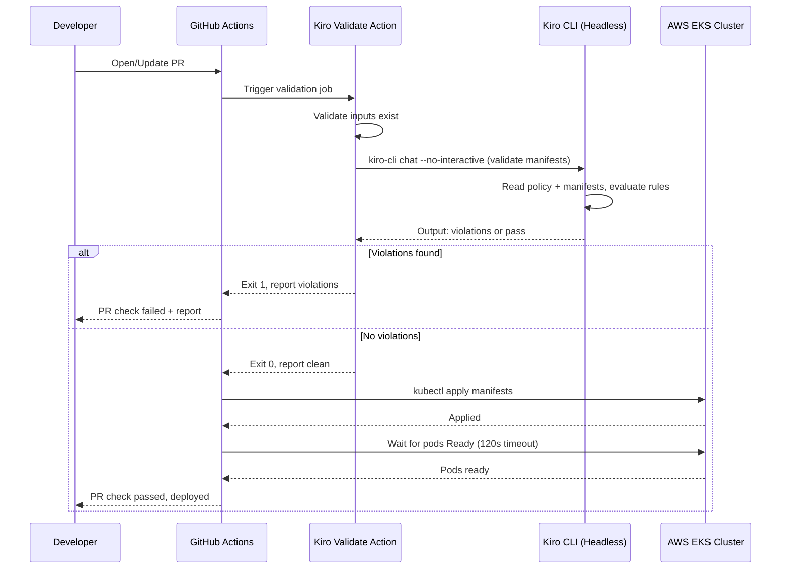

# Design Document

## Overview

This design describes a demo CI/CD pipeline that uses Kiro CLI headless mode as an AI-powered policy gate for Kubernetes deployments to AWS EKS. The system consists of:

1. A **reusable composite GitHub Action** (`kiro-validate-action`) that wraps Kiro headless CLI invocation to validate Kubernetes manifests against a policy steering file.
2. An **EKS best practices steering file** (markdown-based policy) that defines security and operational rules.
3. **Two sample nginx deployments** — one compliant, one non-compliant — that demonstrate pass/fail behavior.
4. A **GitHub Actions workflow** that gates deployment on successful Kiro validation, followed by `kubectl apply` and pod readiness checks.

The pipeline demonstrates a complete feedback loop: PR opened → Kiro validates manifests → fails on violations → developer fixes manifests → re-validates → deploys to EKS → verifies pod readiness.

**Key Design Decisions:**
- Use a **composite action** (not Docker or JavaScript action) for simplicity and transparency — all logic visible in YAML/shell.
- Kiro CLI is installed at runtime from the official installer, keeping the action lightweight.
- The steering file uses structured markdown sections so Kiro can reason about each policy rule independently.
- The workflow uses GitHub Actions job dependencies (`needs:`) to enforce strict gating between validation and deployment.

## Architecture



**Flow:**
1. PR triggers the workflow on `pull_request` events (opened, synchronize).
2. The **validation job** checks out code, runs the Kiro Validate Action against manifests using the EKS policy steering file.
3. If validation fails, the PR check is marked as failed and the report is surfaced.
4. If validation passes, the **deployment job** (dependent on the validation job) proceeds to deploy manifests with `kubectl apply` and verify pod readiness.

## Components and Interfaces

### 1. Kiro Validate Action (`action.yml`)

**Location:** `.github/actions/kiro-validate/action.yml`

A composite action with the following interface:

**Inputs:**
| Input | Required | Description |
|-------|----------|-------------|
| `manifests-path` | Yes | Path to the Kubernetes manifest file(s) to validate |
| `policy-path` | Yes | Path to the EKS policy steering file |

**Outputs:**
| Output | Description |
|--------|-------------|
| `report` | Validation report text with violation details and remediation guidance |

**Steps:**
1. Validate that inputs reference existing paths.
2. Install Kiro CLI via official installer script.
3. Invoke `kiro-cli chat --no-interactive --trust-tools=read,grep` with a prompt instructing Kiro to validate manifests against the policy, outputting structured findings.
4. Parse Kiro output to determine pass/fail status.
5. Set the `report` output and exit with appropriate code.

### 2. EKS Policy Steering File

**Location:** `.kiro/steering/eks-policy.md`

A Kiro-compatible markdown steering file containing structured policy rules. Each rule is a top-level section with:
- Rule name and identifier
- Description of the requirement
- What to check in manifests
- Example of compliant vs non-compliant configuration

### 3. Sample Kubernetes Manifests

**Compliant Deployment Location:** `manifests/compliant/deployment.yaml`
**Non-Compliant Deployment Location:** `manifests/non-compliant/deployment.yaml`

Both define nginx-based Kubernetes Deployments. The compliant version satisfies all policy rules; the non-compliant version intentionally violates them.

### 4. GitHub Actions Workflow

**Location:** `.github/workflows/kiro-policy-gate.yml`

Defines two jobs:
- `validate` — Runs the Kiro Validate Action
- `deploy` — Deploys to EKS (depends on `validate` passing)

### 5. Interaction Diagram



## Data Models

### Kiro Validate Action Inputs Schema

```yaml
# action.yml inputs
inputs:
  manifests-path:
    description: "Path to Kubernetes manifest files to validate"
    required: true
  policy-path:
    description: "Path to the EKS policy steering file"
    required: true
outputs:
  report:
    description: "Validation report with violation details and remediation"
    value: ${{ steps.validate.outputs.report }}
```

### EKS Policy Steering File Structure

```markdown
# EKS Deployment Best Practices Policy

## Rule 1: Resource Requests and Limits
- All containers MUST specify cpu and memory requests
- All containers MUST specify cpu and memory limits
- Requests MUST be less than or equal to limits

## Rule 2: Security Context
- runAsNonRoot MUST be true
- readOnlyRootFilesystem MUST be true
- ALL capabilities MUST be dropped
- Only explicitly needed capabilities may be added

## Rule 3: Health Probes
- All containers MUST define a livenessProbe
- All containers MUST define a readinessProbe
- Probes MUST specify initialDelaySeconds, periodSeconds, timeoutSeconds, failureThreshold

## Rule 4: Image Tag Policy
- Container images MUST NOT use the "latest" tag
- Images MUST reference a specific version tag or SHA256 digest

## Rule 5: Namespace Isolation
- All resources MUST specify an explicit namespace
- Namespace MUST NOT be "default"

## Rule 6: High Availability
- Deployments and StatefulSets MUST have replicas >= 2
```

### Compliant Deployment Structure

```yaml
apiVersion: apps/v1
kind: Deployment
metadata:
  name: nginx-compliant
  namespace: demo-app          # Explicit non-default namespace
spec:
  replicas: 2                  # HA: >= 2
  selector:
    matchLabels:
      app: nginx-compliant
  template:
    metadata:
      labels:
        app: nginx-compliant
    spec:
      securityContext:
        runAsNonRoot: true
      containers:
        - name: nginx
          image: nginx:1.27.3  # Pinned version, not "latest"
          ports:
            - containerPort: 8080
          resources:
            requests:
              cpu: "100m"
              memory: "128Mi"
            limits:
              cpu: "200m"
              memory: "256Mi"
          securityContext:
            readOnlyRootFilesystem: true
            allowPrivilegeEscalation: false
            capabilities:
              drop: ["ALL"]
          livenessProbe:
            httpGet:
              path: /healthz
              port: 8080
            initialDelaySeconds: 10
            periodSeconds: 10
            timeoutSeconds: 3
            failureThreshold: 3
          readinessProbe:
            httpGet:
              path: /ready
              port: 8080
            initialDelaySeconds: 5
            periodSeconds: 5
            timeoutSeconds: 3
            failureThreshold: 3
```

### Non-Compliant Deployment Structure

```yaml
apiVersion: apps/v1
kind: Deployment
metadata:
  name: nginx-non-compliant
  # No namespace — violates Rule 5
spec:
  replicas: 1                  # Violates Rule 6 (< 2)
  selector:
    matchLabels:
      app: nginx-non-compliant
  template:
    metadata:
      labels:
        app: nginx-non-compliant
    spec:
      # No securityContext — violates Rule 2
      containers:
        - name: nginx
          image: nginx:latest  # Violates Rule 4
          ports:
            - containerPort: 80
          # No resources — violates Rule 1
          # No probes — violates Rule 3
```

### GitHub Actions Workflow Structure

```yaml
name: Kiro EKS Policy Gate
on:
  pull_request:
    types: [opened, synchronize]

jobs:
  validate:
    runs-on: ubuntu-latest
    timeout-minutes: 5
    outputs:
      report: ${{ steps.kiro-validate.outputs.report }}
    steps:
      - uses: actions/checkout@v4
      - name: Kiro Validate
        id: kiro-validate
        uses: ./.github/actions/kiro-validate
        with:
          manifests-path: "manifests/"
          policy-path: ".kiro/steering/eks-policy.md"
        env:
          KIRO_API_KEY: ${{ secrets.KIRO_API_KEY }}

  deploy:
    runs-on: ubuntu-latest
    needs: validate
    if: success()
    steps:
      - uses: actions/checkout@v4
      - name: Configure kubectl
        uses: aws-actions/configure-aws-credentials@v4
        with:
          role-to-assume: ${{ secrets.EKS_DEPLOY_ROLE_ARN }}
          aws-region: us-west-2
      - name: Deploy to EKS
        run: kubectl apply -f manifests/
      - name: Verify pod readiness
        run: |
          kubectl wait --for=condition=Ready pods --all -n demo-app --timeout=120s
```

## Correctness Properties

This feature consists of declarative YAML configurations (GitHub Actions workflow, Kubernetes manifests, composite action definition), a thin shell script wrapper around an external AI tool (Kiro CLI), and a markdown-based policy file. There are no pure functions with meaningful input/output variation authored in this project — the validation logic resides entirely within Kiro CLI.

**Property-based testing does not apply** to this feature because:
1. The manifests and workflow files are static declarative artifacts, not functions.
2. The shell script has no transformational logic — it orchestrates an external tool.
3. The policy file is a static document consumed by Kiro CLI's internal reasoning.

Instead, correctness is verified through **structural invariants** (smoke tests) that assert the configuration artifacts are well-formed and internally consistent:

### Property 1: Policy file contains all required rules

*For any* valid EKS policy steering file, the file SHALL contain exactly 6 distinct rule sections covering Resource Requests and Limits, Security Context, Health Probes, Image Tag Policy, Namespace Isolation, and High Availability.

**Validates: Requirements 2.1, 2.2, 2.3, 2.4, 2.5, 2.6, 2.7**

### Property 2: Compliant manifest satisfies all policy rules

*For any* compliant deployment manifest, it SHALL contain: explicit non-default namespace, replicas >= 2, resource requests and limits for all containers, securityContext with runAsNonRoot and readOnlyRootFilesystem, dropped ALL capabilities, liveness and readiness probes with required fields, and a pinned image tag (not "latest").

**Validates: Requirements 4.1, 4.2, 4.3, 4.4, 4.5, 4.6**

### Property 3: Non-compliant manifest violates policy rules

*For any* non-compliant deployment manifest, it SHALL be missing: explicit namespace, adequate replica count, resource specifications, security context, and health probes, and SHALL use the "latest" image tag.

**Validates: Requirements 5.1, 5.2, 5.3, 5.4, 5.5, 5.6**

### Property 4: Action interface defines required inputs and outputs

*For any* valid composite action definition, it SHALL define `manifests-path` and `policy-path` as required inputs, and `report` as an output.

**Validates: Requirements 1.1, 1.5**

### Property 5: Workflow enforces validation before deployment

*For any* valid workflow definition, the `deploy` job SHALL declare an explicit dependency on the `validate` job via `needs`, ensuring deployment cannot proceed without successful validation.

**Validates: Requirements 7.1, 7.2**

## Error Handling

### Kiro Validate Action Error Scenarios

| Error Scenario | Detection | Behavior | Exit Code |
|---|---|---|---|
| Missing `manifests-path` input | Check if variable is empty | Print error: "Error: manifests-path input is required" | 1 |
| Missing `policy-path` input | Check if variable is empty | Print error: "Error: policy-path input is required" | 1 |
| `manifests-path` does not exist | `[ ! -e "$manifests_path" ]` | Print error: "Error: manifests-path '$path' does not exist" | 1 |
| `policy-path` does not exist | `[ ! -f "$policy_path" ]` | Print error: "Error: policy-path '$path' does not exist" | 1 |
| Kiro CLI not installed / install fails | Check installer exit code | Print error: "Error: Failed to install Kiro CLI" | 1 |
| `KIRO_API_KEY` not set | Check if env var is empty | Print error: "Error: KIRO_API_KEY environment variable is not set" | 1 |
| Kiro CLI returns unexpected error | Non-zero exit + no structured output | Print error: "Error: Kiro CLI execution failed unexpectedly" + stderr | 1 |
| Kiro CLI timeout (hangs) | Wrapped with `timeout 240` | Print error: "Error: Kiro CLI execution timed out" | 1 |
| Policy violations found | Parse Kiro output for violations | Print report to stdout, set output, exit non-zero | 1 |
| No violations | Parse Kiro output showing pass | Print success to stdout, set output, exit zero | 0 |

### Action Shell Script Error Strategy

```bash
#!/bin/bash
set -euo pipefail

# Input validation first — fail fast before any expensive operations
# Then install Kiro CLI
# Then validate KIRO_API_KEY is available
# Then invoke Kiro with timeout wrapper
# Parse output and determine pass/fail
```

Key principles:
- **Fail fast**: Validate all inputs before invoking Kiro CLI.
- **Timeout protection**: Wrap Kiro CLI invocation with `timeout 240` (4 minutes, leaving 1 minute buffer within the 5-minute job timeout).
- **Distinct error messages**: Each failure mode produces a unique, actionable error message so the developer knows exactly what to fix.
- **No secrets in output**: Never echo the API key; use it only as an environment variable.

### GitHub Actions Workflow Error Handling

| Error Scenario | Detection | Behavior |
|---|---|---|
| Validation job times out | `timeout-minutes: 5` | Job cancelled, PR check marked as failed |
| Validation step fails | Non-zero exit from action | Job fails, report available in logs and step output |
| `kubectl apply` fails | Non-zero exit code | Deploy job fails with "Deployment command failed" message |
| Pods don't reach Ready within 120s | `kubectl wait` timeout | Deploy job fails with "Pod readiness check timed out" message |
| AWS credentials misconfigured | `configure-aws-credentials` failure | Deploy job fails before kubectl runs |

### Workflow Summary Reporting

The workflow uses `$GITHUB_STEP_SUMMARY` to write human-readable summaries:
- On validation failure: includes the violation report
- On deployment failure: includes the kubectl error output
- On success: confirms manifests validated and deployed

## Testing Strategy

### Why Property-Based Testing Does Not Apply

This feature is primarily composed of:
- **Declarative configuration** (GitHub Actions YAML, Kubernetes manifests, markdown policy file)
- **A thin shell wrapper** around an external tool (Kiro CLI)
- **Infrastructure integration** (GitHub Actions platform behavior, EKS cluster)

There are no pure functions with meaningful input variation in our code. The validation logic lives inside Kiro CLI (an external AI tool), not in code we author. The manifests are static artifacts, and the workflow relies on GitHub Actions' built-in job dependency mechanics. Property-based testing is not appropriate here.

### Testing Approach

#### 1. Static Analysis / Smoke Tests

Verify the structural correctness of all configuration artifacts without running them:

- **Policy file completeness**: Parse `eks-policy.md` and verify all 6 rules are present as distinct sections.
- **Workflow structure**: Parse `kiro-policy-gate.yml` and verify:
  - Trigger is `pull_request: [opened, synchronize]`
  - `validate` job has `timeout-minutes: 5`
  - `deploy` job has `needs: [validate]`
  - Deploy job contains `kubectl apply` and `kubectl wait --timeout=120s`
- **Action interface**: Parse `action.yml` and verify both inputs are defined as required, and `report` output exists.
- **Manifest compliance check**: Parse both YAML manifests and programmatically verify the compliant one has all required fields (resources, securityContext, probes, pinned tag, namespace, replicas >= 2) and the non-compliant one is missing them.

**Tools**: A simple shell script or Python script using `yq` / `pyyaml` to parse YAML and verify field presence.

#### 2. Unit Tests (Action Script Logic)

Test the shell script logic of the composite action in isolation using mocked Kiro CLI:

- **Input validation tests**: Verify the script exits non-zero with correct error messages for missing/invalid inputs.
- **Exit code mapping tests**: Mock Kiro CLI responses (violations found, no violations, crash) and verify the action produces correct exit codes and outputs.
- **Output formatting tests**: Verify the action writes to `$GITHUB_OUTPUT` in the correct format.

**Tools**: `bats-core` (Bash Automated Testing System) for shell script testing, with Kiro CLI mocked as a stub script.

#### 3. Integration Tests

End-to-end tests that require a running GitHub Actions environment or local simulation:

- **Compliant manifest passes validation**: Run the actual Kiro Validate Action against the compliant manifest with a real API key. Verify exit 0 and clean report.
- **Non-compliant manifest fails validation**: Run against the non-compliant manifest. Verify exit 1 and report lists all violations.
- **Remediation flow**: Take the non-compliant manifest, apply fixes, re-validate, verify pass.
- **Deployment gating**: Verify that when validation fails, the deploy job is skipped (requires a test workflow run).

**Tools**: GitHub Actions workflow runs in a test repository, or `act` (local GitHub Actions runner) for faster iteration.

#### 4. Manual Verification Checklist

For aspects that cannot be automated:
- [ ] PR branch protection rule requires the Kiro validation check to pass
- [ ] Validation report is readable and actionable in the GitHub Actions check run details
- [ ] EKS deployment succeeds with the compliant manifest on a real cluster
- [ ] Pod readiness timeout produces a clear error message

### Test File Locations

```
tests/
├── smoke/
│   ├── test-policy-completeness.sh    # Verify all rules present in policy
│   ├── test-workflow-structure.sh     # Verify workflow YAML structure
│   └── test-manifest-compliance.sh   # Verify manifest fields
├── unit/
│   └── test-action-script.bats       # bats-core tests for action shell logic
└── integration/
    └── README.md                      # Instructions for running integration tests
```

